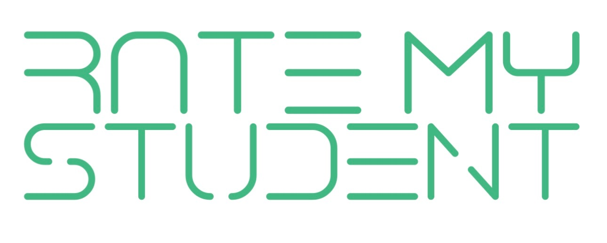
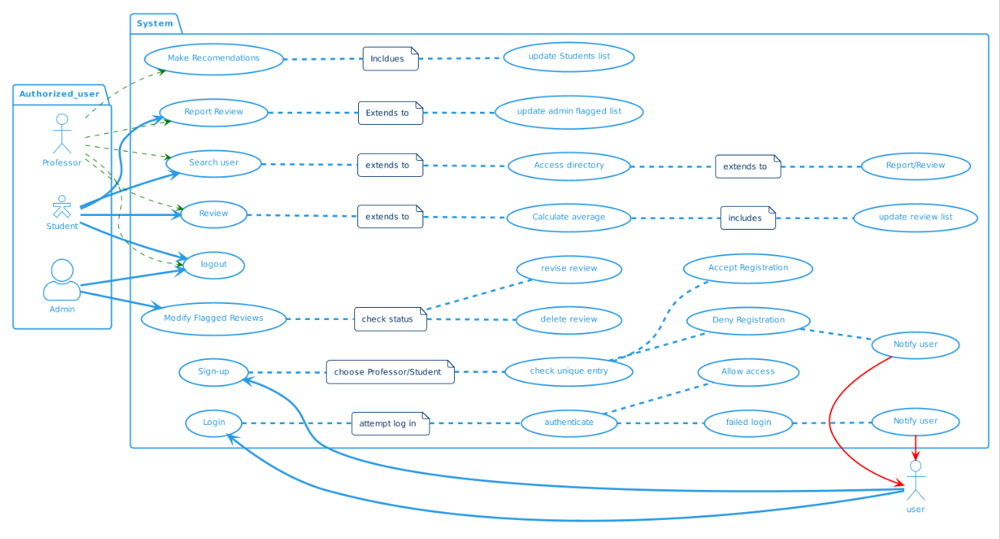
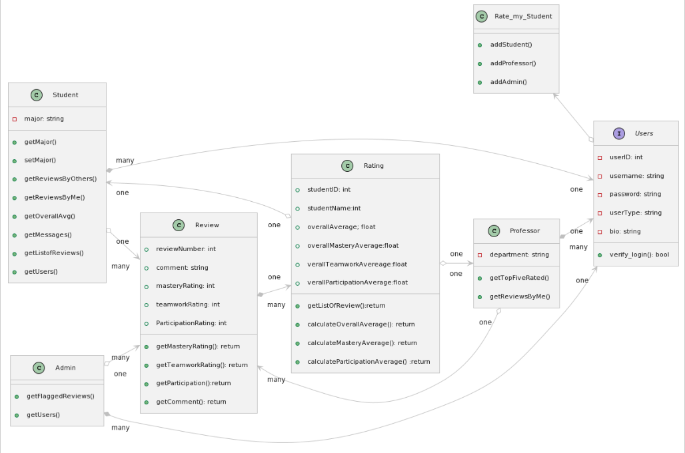

# Overview

##Use this section to outline the vision for the product to be developed, including a use case diagram that shows the main user interactions with the product, in order to provide readers with an overview of the project.

The 'Rate My Student' app envisions creating a transparent and collaborative educational ecosystem by providing a platform for constructive feedback and performance evaluation. Our software aims to address the challenge of subjective assessment and foster a positive learning environment for students. The primary goal is to empower educators and students themselves to contribute valuable insights into individual learning journeys. This app targets educational institutions, professors, and students. By encouraging open communication and feedback, 'Rate My Student' strives to enhance the educational experience, promote continuous improvement, and ultimately contribute to the success and well-rounded growth of every student.

# Design

## User Stories

Describe the user stories designed for the project, including clear acceptance criteria and point estimates for each of them. User stories must be consistent with the use case diagram. Refer to the user stories using US#1, US#2, etc. At least one of the user stories, not related to user creation or authentication, must be detailed by a sequence diagram. 

### US#1

*As a user, I want to register on the online platform as a student or a professor so that I can log-in. Given that a user provides an ID number, name, email, password, major, department, and a small biography, user information is saved when the user clicks on the "Sign Up" button, and a user profile is created. When signup is successful, an authorized user can log-in with my email and password. If credentials are valid, I can access my reviews, search through a directory of other users and their ratings, create reviews, view my recommendations, and log out.*

Additional Information:
* Student sign-up includes Id, name, major, email, biography, and password*
* Professor sign-up includes Id, name, department, biography, email, password. *
* Professors will only display the reviews they have created."

### US#2 

*As an authenticated user, from the homepage, I want to access a user directory to search for a professor or a student. I can select a user to view their information and stats. I can view essential details for each user such as their name, occupation (student/professor), a short bio, major/department, average review for different criteria, and a list of their reviews.* 

Additional information:

* Students will have a name, major, bio, and average reviews of different criteria. *
* Professors will have name, department, and bio. *
* reviews displayed should only show the comment and review left. Users who left the review should remain anonymous. *

### US#3 
*As an authorized user, I can leave a review when I access another user's review page. When the user clicks the "Review" button, the user will be directed to create a review. If the subject being reviewed is a professor, the user will be directed to ratemyprofessor.com. If the review is for a student, the user will be redirected to a form to rate students based on mastery of subject matter, work ethic, collaboration and teamwork, and leave a comment. The user will click the "submit button" when the review is complete. The student being reviewed will update to include the new review made and will display on their profile. Upon submission, individual criteria and overall average will be recalculated and updated.*

Additional Information: 
* Students will have a review form. *
* Professors will be redirected to ratemyprofessor.com *
* The criteria will be on a scale of 1-5. *

### US#4 

*As a student, I can access a list of the reviews that my cohort has made for me. I can select the review and click the "Report" button. Upon reporting, the flagged review will be made available to the admin for investigation.*

Additional information: 
* Flagged review will be added to the Admin list of flagged reports. *

###6 US#5 

*As a professor, I can recommend a student for academic opportunities. I can access a list of  5 students with the highest reviews from my home page to gain insight into potential candidates. I can access a list of users from a directory. When I select a user, I can click the "recommend" button. Upon recommendation, the student recommendation list will be updated, and a message will be sent to the student. Students will have the ability to access messages from their home page.*

### US#6

*As an admin, I will have a list of flagged reviews for investigation on my homepage. I can modify or delete flagged reviews. I can also warn a user for using inappropriate language and behavior. I can select the user involved, and upon clicking "Send Warning," the user will have a warning sent to their message page.*

## Model 

At a minimum, this section should have a class diagram that succinctly describes the main classes designed for this project, as well as their associations.
### Use Case Diagram

### Class Diagram

# Development Process 

This section should be used to describe how the scrum methodology was used in this project. As a suggestion, include the following table to summarize how the sprints occurred during the development of this project.

|Sprint#|Goals|Start|End|Done|Observations|
|---|---|---|---|---|---|
|1|US#1, US#2, ...|mm/dd/23|mm/dd/23|US#1|...|

Use the observations column to report problems encountered during a sprint and/or to reflect on how the team has continuously improved its work.

Feel free to use your own format for this section, as long as you are able to communicate what has been described here.

# Testing 

Share in this section the results of the tests performed to attest to the quality of the developed product, including the coverage of the tests in relation to the written code. There is no minimum code coverage expectation for your tests, other than expecting "some" coverage through at least one white-box and one black-box test.

# Deployment 

The final product must demonstrate the integrity of at least 5 of the 6 planned user stories. The final product must be packaged in the form of a docker image. In this section, describe the steps needed to generate that image so that others can deploy the product themselves. All files required for the deployment must be available, including the docker file, source/binary code, external package requirements, data files, images, etc. Instructions on how to create a container from the docker image with parameters such as port mapping, environment variables settings, etc., must be described (if needed). 
